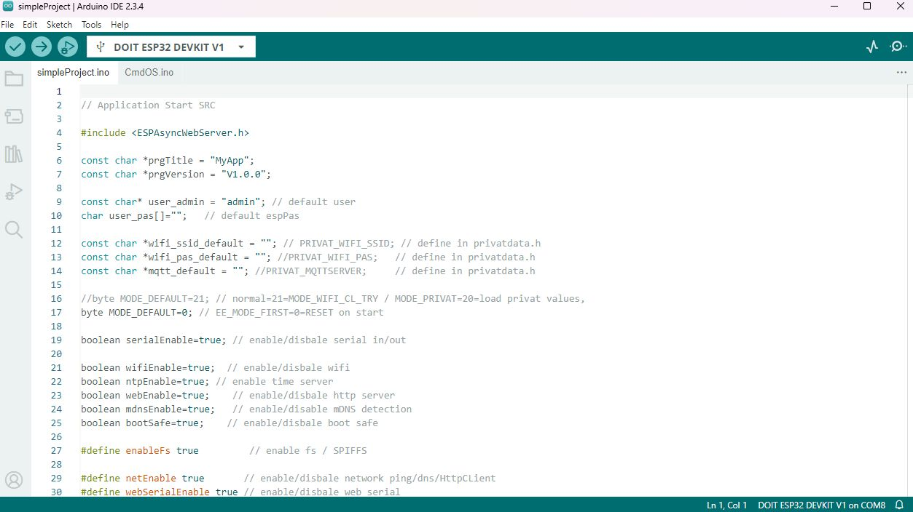

# CmdOC build new project

## Develop with CmdOS

Create a new project and add CmdOS_x.ino as CmdOS-Tab.

## Build own Application

CmdOS do not have to run on its own, like Tasmota or EspHome. 
The idea is to build up own development and include CmdOS as a singel file/tab <a href='release/CmdOs_V010.ino'>CmdOS</a>.

## Aplication-tab

Replace first application-tab with

	#include <ESPAsyncWebServer.h>
	 
	const char *prgTitle = "MyApp";
	const char *prgVersion = "V1.0.0";

	const char* user_admin = "admin"; // default user
	char user_pas[]="";   // default espPas

	const char *wifi_ssid_default = ""; // PRIVAT_WIFI_SSID; // define in privatdata.h 
	const char *wifi_pas_default = ""; //PRIVAT_WIFI_PAS;   // define in privatdata.h 
	const char *mqtt_default = ""; //PRIVAT_MQTTSERVER;     // define in privatdata.h 

	byte MODE_DEFAULT=21; // normal=21=MODE_WIFI_CL_TRY / MODE_PRIVAT=20=load privat values, 

	boolean serialEnable=true; // enable/disbale serial in/out

	boolean wifiEnable=true;  // enable/disbale wifi
	boolean ntpEnable=true; // enable time server
	boolean webEnable=true;    // enable/disbale http server
	boolean mdnsEnable=true;   // enable/disable mDNS detection 
	boolean bootSafe=true;    // enable/disbale boot safe

	#define enableFs true         // enable fs / SPIFFS

	#define netEnable true       // enable/disbale network ping/dns/HttpCLient 
	#define webSerialEnable true // enable/disbale web serial
	#define mqttEnable false      // enable/disbale mqtt

	#define otaEnable true        // enabled/disbale ota update 
	#define updateEnable true     // enabled/disbale update firmware via web 

	#define ledEnable false       // enable/disbale serial
	int ledGpio=15;            // io of led
	boolean ledOnTrue=true;           // gpio false=led-on

	#define swEnable false        // enable/disbale switch
	int swGpio=0;                // io pin of sw 
	int swTimeBase=100;       // prell and lonePress Timebase (e.g. 100ms)
	boolean swOnTrue=false;      // gpio false=sw-pressed
	boolean swPullUp=true;      // enabel pullUp for sw

	int _webPort = 80;
	AsyncWebServer server(_webPort);

	//--------------------------------------------------------------

	char* appCmd(char *cmd, char **param) {
	  return cmd; // unkown cmd => use cmd as string
	}

	//--------------------------------------------------------------

	/* callback to add app web pages */
	void webApp() {
	//  server.on("/app", HTTP_GET,  { matrixWeb(request); });
	//  server.on("/appSetup", HTTP_GET,  { matrixWebSetup(request); });
	}

	//--------------------------------------------------------------

	void setup() {
	  cmdOSSetup();
	  if(isModeNoError()) { 
		// all work fine - app setup here
		appSetup();
	  }  
	}

	void loop() {
	  cmdOSLoop();
	  if(isModeNoError()) { 
		// all works fine - app loop here 
		appLoop();
	  }  
	}

 a OpenOn.org project - develop by mk@almi.de 

	

	

